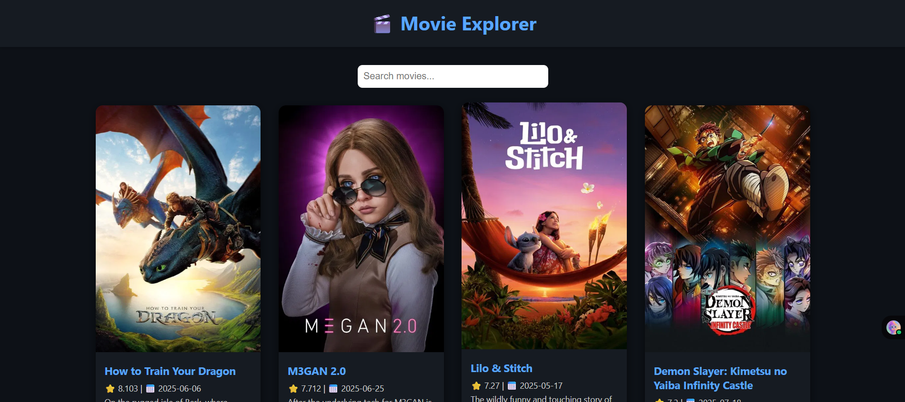

---
# 🎬 Movie Database App

----


A clean and responsive movie browsing web app built using **React**, **Vite**, and **Vanilla CSS**. It fetches live movie data from the **TMDB API** and displays popular movies with support for keyword-based search. This assignment showcases core React fundamentals and API integration without using any CSS frameworks.

---

## 🌐 Live Demo

🔗 [**Visit Live App →**](https://movie-db-assignment-git-main-mukund-thakurs-projects.vercel.app/)

---

## 📌 Features

- 🔍 **Search Movies** — by title using TMDB live API
- 🎬 **Popular Movies** — auto-fetches trending content
- 🎥 **Movie Details** — overview, poster, release date, vote average
- 🧭 **Responsive Design** — usable on both desktop and mobile
- 🧹 Clean, minimalist UI with custom **Vanilla CSS**

---

## 🛠️ Tech Stack

| Technology | Purpose                           |
|------------|-----------------------------------|
| **React**  | Frontend component structure      |
| **Vite**   | Fast build tool & dev server      |
| **TMDB API** | Live movie data fetching        |
| **Vanilla CSS** | Custom styles, no frameworks |

---

## 📁 Project Structure

```

movie-db-app/
│
├── public/
│   └── favicon.svg
│
├── src/
│   ├── components/
│   │   ├── Header.jsx
│   │   ├── SearchBar.jsx
│   │   └── MovieCard.jsx
│   ├── styles/
│   │   └── app.css
│   ├── App.jsx
│   └── main.jsx
│
├── .env
├── preview\.png
├── index.html
└── vite.config.js


---

## 🚀 Getting Started Locally

To run the app on your machine:

```bash
git clone https://github.com/your-username/movie-db-assignment.git
cd movie-db-assignment
npm install
npm run dev
````

---

## 📦 Deployment

This project is deployed using **Vercel**.

🔗 [Live App URL](https://movie-db-assignment-git-main-mukund-thakurs-projects.vercel.app/)

---

## ✅ Assignment Criteria Covered

* ✅ Live search using real API
* ✅ React component structure
* ✅ Vite for build and development
* ✅ Vanilla CSS (No Tailwind/Bootstrap)
* ✅ Deployed and working link
* ✅ `.env` usage for API key security
* ✅ README with preview and instructions

---

## 👨‍💻 Author

**Mukund Thakur**
📧 [mukund.th04@gmail.com](mailto:mukund.th04@gmail.com)
🔗 [LinkedIn](https://www.linkedin.com/in/mukund-thakur-b9949b212/)

---

